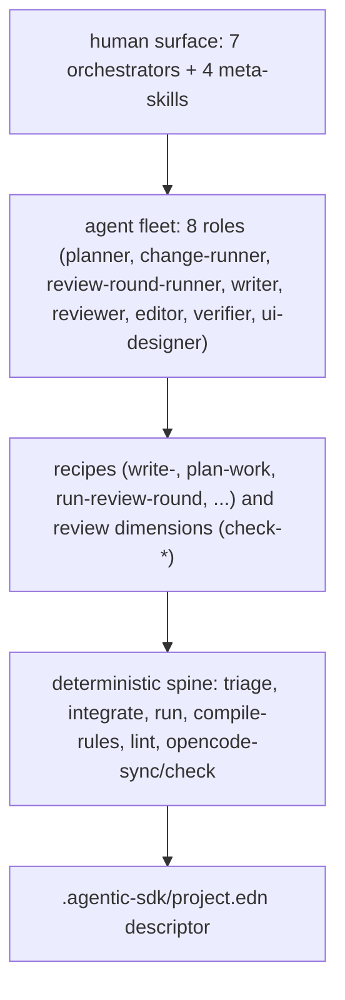

# agentic-sdk

A runtime-agnostic system of skills, agents, and a deterministic spine for
software development across a bounded stack: C, Zig, Clojure, Elixir. One
architecture ties them together: Functional Core, Imperative Shell, with native
edges between languages.

Claude Code is the master format; an OpenCode projection is generated from it.
Install once into a project and the same system drives either runtime.

## What it gives you

A small set of deep orchestrators that run big pieces of work autonomously
between approval gates:

| Orchestrator | Does |
|---|---|
| `plan-system` | Turn a problem into an approved backlog and plan |
| `advance-plan` | Build a chunk of the plan unattended, phase by phase |
| `implement-change` | Build one change or slice end to end |
| `audit-code` | Review and fix any scope until a round finds nothing |
| `investigate` | Triage an incident to root cause and follow-up |
| `fix-bug` | Fix one bug with a regression test |
| `ship` | Cut a release |

Four meta-skills tailor the system itself: `bootstrap-project` (install into a
project), `add-language`, `add-dimension`, `add-tech`. Everything else is
model-invoked (recipes, primitives, review dimensions), composed by these
orchestrators. The full inventory lives in [docs/design.md](docs/design.md).

## Architecture

- A deterministic **spine** (Babashka and EDN) owns the clerical work: triage,
  integration, resumption, rule projection, prose lint. The model is left to
  judgment.
- A fleet of 8 **agents** does the work in isolated contexts, returning
  one-line summaries upward (context is the budget).
- A **descriptor** (`.agentic-sdk/project.edn`) tunes the system per project:
  languages, lanes, active review dimensions, spine level.

## Install

agentic-sdk is promptware: the skills and agents are the software, the model is
the runtime. Clone this repo, then in a target project run the `bootstrap-project`
skill (the toolkit's skills must be reachable from your runtime). It:

1. Detects the stack (`deps.edn`, `build.zig`, `mix.exs`, `CMakeLists.txt`, ...).
2. Writes `.agentic-sdk/project.edn`.
3. Snaps the active `write-<lang>` recipes, the spine, and the hook templates
   into `.agentic-sdk/`.
4. Symlinks `.claude/{skills,agents,hooks}` into `.agentic-sdk/` (the Claude
   Code adapter) and generates `.opencode/agent/` (the OpenCode adapter).
5. Drops a project `CLAUDE.md` and a `.gitignore`.

The install home is `.agentic-sdk/`. Commit only `.agentic-sdk/project.edn`,
`.agentic-sdk/artifacts/`, the root `CLAUDE.md`, and the small runtime configs
(`.claude/settings.json`, `.opencode/opencode.json`); the snapped-in masters,
the spine, runs, and working state are gitignored and re-installable. The full
layout and commit policy are in [docs/design.md](docs/design.md).

## The spine

The deterministic spine runs as Babashka tasks over an EDN working directory:

| Task | Does |
|---|---|
| `triage` | Fold findings into one ordered punch list |
| `integrate` | Land parallel fix branches oldest-first |
| `run` | Resumption state (`bb run init\|status\|advance`) |
| `compile-rules` | Project decisions to lint rules |
| `lint` | House prose pre-pass plus a detected project linter |
| `opencode-sync` / `opencode-check` | Project and verify the OpenCode adapter |

The interface is stable; the runtime can swap (a future static-binary task
runtime and an immutable-fact store) without touching the skill layer.

Verify the spine: `bb test`. Prose-lint the docs: `bb lint`.

## Status

agentic-sdk is a fresh, runtime-agnostic system. It replaces an earlier
Claude-Code-only edition.

## License

MIT
