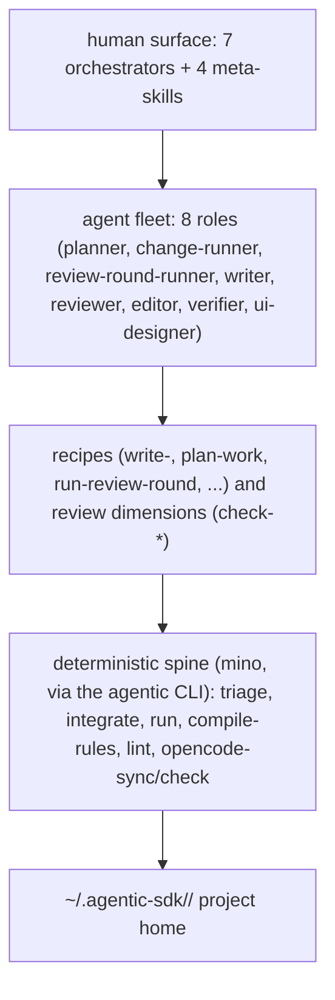

# agentic-sdk

A runtime-agnostic system of skills, agents, and a deterministic spine for
software development across a bounded stack: C, Zig, Clojure, Elixir. One
architecture ties them together: Functional Core, Imperative Shell, with native
edges between languages.

Claude Code is the master format; an OpenCode projection is generated from it.
Install it once system-wide and attach it to any project; the same system drives
either runtime.

## What it gives you

A small set of deep orchestrators that run big pieces of work autonomously
between approval gates:

| Orchestrator | Does |
|---|---|
| `plan-system` | Turn a problem into an approved backlog and plan |
| `advance-plan` | Build a chunk of the plan unattended, phase by phase |
| `implement-change` | Build one change or slice end to end |
| `audit-code` | Review and fix any scope until a round finds nothing |
| `investigate` | Triage an incident to root cause and follow-up |
| `fix-bug` | Fix one bug with a regression test |
| `ship` | Cut a release |

Four meta-skills tailor the system itself: `bootstrap-project` (install into a
project), `add-language`, `add-dimension`, `add-tech`. Everything else is
model-invoked (recipes, primitives, review dimensions), composed by these
orchestrators. The full inventory lives in [docs/design.md](docs/design.md).

## Architecture

- A deterministic **spine** runs as mino scripts through the `agentic` CLI
  over an EDN working dir. It owns the clerical work: triage, integration,
  resumption, rule projection, prose lint. The model is left to judgment.
- A fleet of 8 **agents** does the work in isolated contexts, returning
  one-line summaries upward (context is the budget).
- A **project home** at `~/.agentic-sdk/<project>/` holds the per-project
  state: the descriptor (languages, lanes, active review dimensions, spine
  level), working state, and generated adapters. None of it touches the repo.

## Install

agentic-sdk is promptware you install once system-wide, then attach to any
project. The skills and agents are the software; the model is the runtime.

1. Clone this repo to a fixed location (for example `~/Code/agentic-sdk`).
2. Set `AGENTIC_SDK_SRC` in your shell profile to point at it.
3. Make sure `mino` is on PATH (the spine runs under mino, not Babashka).
4. In any project, run `agentic setup` from the project root. It creates the
   project home at `~/.agentic-sdk/<project-name>/`, symlinks skills, agents,
   and hooks from the SDK source, generates the Claude and OpenCode adapters,
   and creates three hidden symlinks in the project root.
5. The project repo stays completely clean: no `.gitignore` entries, no
   committed AI files. The only footprint is three symlinks, hidden via
   `.git/info/exclude`.

The `agentic` CLI lives at `$AGENTIC_SDK_SRC/bin/agentic`. Put
`$AGENTIC_SDK_SRC/bin` on PATH. The full layout and commit policy are in
[docs/design.md](docs/design.md).

## The spine

The deterministic spine runs as mino scripts through the `agentic` CLI over an
EDN working directory. The task names are unchanged; only the invocation
shifts, from `bb triage` to `agentic triage`:

| Task | Does |
|---|---|
| `triage` | Fold findings into one ordered punch list |
| `integrate` | Land parallel fix branches oldest-first |
| `run` | Resumption state (`agentic resume init\|status\|advance`) |
| `compile-rules` | Project decisions to lint rules |
| `lint` | House prose pre-pass plus a detected project linter |
| `opencode-sync` / `opencode-check` | Project and verify the OpenCode adapter |

The interface is stable; the runtime sits behind a host seam, so it can swap
without touching the skill layer.

Verify the spine: `bb test` (the test suite). Prose-lint: `agentic lint`.

## Status

agentic-sdk is a fresh, runtime-agnostic system. It replaces an earlier
Claude-Code-only edition.

## License

MIT
