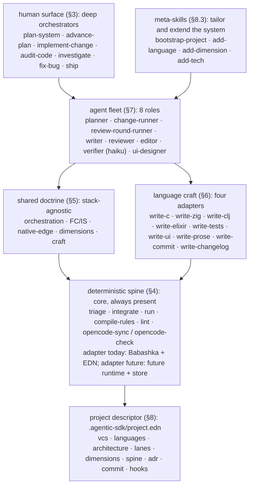

# agentic-sdk

The architecture of the skill system: a runtime-agnostic set of skills, agents,
and a deterministic spine for software development across a bounded stack.

## 1. Goal and constraints

One skill system, reused across every project, serving a bounded stack
(**C, Zig, Clojure, Elixir**) that shares one architecture
(**Functional Core / Imperative Shell**, with native edges between languages).

Hard constraints:

1. **One neutral home.** This repo (`agentic-sdk`) is the system. Installed
   into a project, it owns a neutral `.agentic-sdk/` home: snapped-in masters
   (skills, agents, hooks, spine, templates), the descriptor, the artifacts
   tree, and the spine working dir. Two thin runtime adapters sit over it:
   `.claude/` as symlink skills/agents/hooks plus a settings hook block;
   `.opencode/` as generated agent projection plus config. Masters never live
   under the adapters.
2. **The deterministic spine is core, always present**, but its implementation
   is an interface with a migration path: today **Babashka + EDN**; a future
   static-binary task runtime (one static binary, zero deps) replaces bb, and a
   future immutable-fact store replaces EDN files as the store. The skill/agent
   layer talks to the spine through **stable task names + a stable working-dir
   format**, never to bb or EDN directly, so the swap is localized.
3. **Descriptor + generated recipes.** A `bootstrap-project` meta-skill detects
   the stack, writes a project descriptor, and materializes concrete `write-<lang>`
   recipes from templates. Maintenance = skeleton + 4 curated recipes + detector,
   not N copies.
4. **Full lifecycle**, but the **human-invoked surface is a handful of deep
   orchestrators** that run big pieces of work autonomously between approval
   gates. Everything else is model-invoked.

Design principles:

- **Context is the budget.** Orchestrators read only the one-line returns of
  dispatched sub-agents, never diffs, file bodies, findings dumps, or reasoning.
  Push work down; keep only summaries up.
- **Hand-off is return values, plus disk for the spine.** Sub-agents return one
  contracted line; the spine folds EDN deterministically and is the system of
  record for resumable campaigns.
- **Forward-only DAG.** Work flows one direction; a wrong earlier decision is a
  new forward task plus a decisions entry, not a rewind.
- **Decide and record, never stall.** Agents make the best call, log a
  `DECIDED:` line, and continue. Only the final land waits for the maintainer.
- **No judgment, no model call.** Anything the model would do identically every
  time given the same inputs is promoted to the spine.
- **Tech-stack agnostic at the doctrine layer; concrete at the craft layer.** The
  4 supported languages get real recipes; everything else gets shared doctrine.
- **jj-first VCS.** The descriptor defaults to jj (Jujutsu, git-compatible);
  `write-commit` mandates jj. Existing git repos work via jj's git compatibility,
  and the VCS adapter in the spine detects which is present.

## 2. Architecture overview



Cross-cutting, applied across every layer: policy-as-hooks (§9), artifacts and
run-state (§10), and the runtime port (§12).

## 3. The human-invoked surface: few and deep

A small number of deep orchestrators do big pieces of work autonomously between
approval gates. Everything else is model-invoked (recipes, primitives), reached
by these seven entry points. Meta-skills (section 8.3) are a separate class
that retunes the system itself and are not entry points.

| Entry point | What it does | Approval gates |
|---|---|---|
| `plan-system` | Upstream: turn a problem or idea into an approved backlog and implementation plan. Runs describe-problem to requirements to risks to design-ux (if applicable) to design-technical to backlog to plan, with the Gherkin elicitation gate folded in. | one: the plan/backlog |
| `advance-plan` | **Campaign.** Take a chunk of the plan and build it unattended, phase by phase, dispatching one change-runner per phase through the full implement-review-fix engine. | one up front |
| `implement-change` | **Phase.** Build one change or slice end to end (plan units, tests, impl, integrate, verify, at most 2 review rounds). The lighter entry when there is no campaign. | final land |
| `audit-code` | Review and fix any scope until a round finds nothing new. | final land |
| `investigate` | Ops: triage an incident to root cause and follow-up. | follow-up plan |
| `fix-bug` | Fix one bug: reproduce, failing test, source fix, verify, one commit. | none |
| `ship` | Cut a release end to end. | the tag |

## 4. The deterministic spine

**Core, always present.** The clerical work the model used to do by hand
(triage ordering, parallel-fix integration, resumption state, rule projection)
is owned by deterministic tasks. The model is left to judgment.

### 4.1 The interface (stable; what the skill/agent layer calls)

These names are the contract. The implementation behind them swaps; the calls
do not.

| Task | Reads | Writes | Owns |
|---|---|---|---|
| `triage` | findings dir | `punch-list.edn` and `.md` | dedup, drop protected idioms, order by editing-level then severity, renumber findings |
| `integrate` | fix branches / finding-ids | landed branch and consumed fix branches | cherry-pick parallel fixes oldest-first, report conflicts |
| `run` | scope | directive EDN | compute next directive (run-stage / next-round / next-phase / complete) plus staleness and gate arming |
| `compile-rules` | decisions | lint rules and commit categories | decisions to enforced rules (one-way, deterministic) |
| `lint` | source files | findings EDN | zero-token mechanical pre-pass (style regexes; the AI-tells catalog) |
| `opencode-sync` | `.agentic-sdk/agents` masters | `.opencode/agent/` derived | project masters into the OpenCode format |
| `opencode-check` | masters and derived | exit code | fail the lane when the derived form is stale |

### 4.2 The adapter today: Babashka and EDN

Babashka tasks over an EDN working dir at `.<project>/` (configurable). Every
`bb` task is a pure function on the unambiguous cases and refuses with a
structured escalation on the ambiguous ones (escalate-don't-guess).

### 4.3 The adapter future: the future runtime and store

A future static-binary task runtime (a dependency-free, pure-native,
static-binary executable) replaces bb as the task runtime, eliminating the
JVM/bb install burden for C/Zig/Elixir projects. A future immutable-fact store
replaces EDN files as the store: run-state, findings, decisions become datoms.
**Same task names, same working-dir semantics, different runtime.** The
skill/agent layer is unaware.

Because the future runtime ships as one static binary with zero dependencies,
the spine becomes installable into **any** of the four language stacks
uniformly. This is the architectural payoff of the migration.

### 4.4 Spine-presence levels

A project sits at one of three spine-presence levels, recorded in the descriptor:

- **Full spine**: bb tasks plus an EDN working dir (Clojure projects today; any
  project with bb installed). Maximum guarantees.
- **Thin spine**: plain shell-script stand-ins for `lint`, `integrate`, and
  `run` only; the rest falls back to return-value hand-off. For
  C/Zig/Elixir projects without bb.
- **Return-value-only**: no spine tasks. The engine still works; long campaigns
  re-derive ground truth from `git log` and `ls`.

## 5. The shared doctrine layer

Written once, stack-agnostic, the bulk of the system. Lives under
`skills/<recipe>/references/` and a top-level `references/`.

- **`references/orchestration.md`**: context-as-budget, forward-only DAG,
  module-batch fan-out, level-ordered editor waves, autonomy/escalation, the
  phase-exit contract, resumption, runtime adaptation (Agent-tool fan-out vs
  Skill-tool inline).
- **`references/worktree-model.md`**: topology, ordering law (tests before
  implementations; module integration order), conflict law, when to inline vs
  fan out.
- **`references/architecture.md`**: **Functional Core / Imperative Shell** as the
  house pattern; dependency direction (inward); the pure/shell/native three-way
  split; how each of C/Zig/Clojure/Elixir expresses FC/IS; the native boundary
  contract (data in / data out / opaque handles / lifetime discipline). Each
  `write-<lang>` recipe references this instead of restating it.
- **`references/review-model.md`**: the dimension catalog, the level discipline
  (correctness, then factoring, then style; prose: developmental, content, line,
  copy), the finding shape (EDN: dimension, severity, level, file, evidence,
  suggestion), the round cap (2 per phase; `audit-code` uncapped until dry).
- **`references/prose-style.md`** and **`references/style-foundations.md`**: the
  AI-tells catalog, the no-process-ID rule, the commit-message form. Backs
  `write-prose` and `write-commit`, and the `lint` spine task.
- **`references/pyramid.md`**: the test taxonomy. Which surface, which tier,
  "every assertion must be able to fail."

**Authoring discipline.** Every `SKILL.md`, agent `.md`, and reference in this
toolkit is authored under the prose standard (`references/prose-style.md`): no
em-dashes, no AI tells, no process IDs, terse humanized prose. `write-prose` is
invoked for any prose the system produces and `check-style` enforces it. This
doc is no exception. The public repo never names predecessor or private
projects, and carries none of their domain framing.

## 6. The language craft layer

Four thin adapters, each a `write-<lang>` recipe that says "implement FC/IS the
*<lang>* way" plus the language's specific rigor. They share the skeleton:

1. Frontmatter `name: write-<lang>`, `user-invocable: false`.
2. Open with four anchors: the style-standard file, the architecture contract,
   the placement source (module map), and the ADR log ("scan before designing
   against an unexplained rule").
3. Numbered procedure: **place it, then language discipline, then failure model,
   then verify like the lanes**. The discipline slot is the only part that varies.
4. Tests-first; terse comments; the public-text rule.

| Recipe | Discipline slot (what varies) |
|---|---|
| `write-c` | GC ownership up front; error classes; the add-a-primitive / add-a-special-form rituals |
| `write-zig` | Explicit allocator discipline (`defer`/`errdefer`, allocator-per-phase); error unions plus structured diagnostics; no allocation on hot paths |
| `write-clj` | Pure core (data and pure fns) / imperative shell (state, IO) / native wrapper split; bound untrusted seqs before realizing; decode native scalars to domain |
| `write-elixir` | Pure functions in modules / GenServers plus OTP as the shell; supervision trees; NIF boundary discipline (when calling C/Zig) |

Supporting craft recipes (shared, not per-language): `write-tests`, `write-ui`,
`write-prose`, `write-commit`, `write-changelog`. Native-edge doctrine
(C ABI, NIF, a JVM-to-Zig foreign-function edge) lives in
`references/architecture.md` and is cited by whichever `write-<lang>` touches
the boundary.

`bootstrap-project` **materializes** the active `write-<lang>` recipes into the
project from templates, parameterized by the descriptor's `:languages`. The
toolkit ships the four curated masters; the meta-skill copies in only the ones
the project uses.

## 7. The agent fleet

Canonical 8, with documented scale-down configs.

| Agent | Model | Role | Loads |
|---|---|---|---|
| `planner` | inherit | Decompose a chunk into a forward-only DAG; write plan; return summary | `plan-work` |
| `change-runner` | inherit | Run one phase or slice end to end; return one line | `implement-change` |
| `review-round-runner` | sonnet | One review round: lanes, fan-out, triage, editor waves, verify | `run-review-round` |
| `writer` | inherit (+ risk-tier override) | Write one unit (impl or tests) | `write-<lang>` / `write-tests` |
| `reviewer` | sonnet (read-only) | One dimension on one shard; EDN findings or `NO FINDINGS` | a `check-*` |
| `editor` | sonnet | Fix one module's punch-list at one level | `apply-findings` |
| `verifier` | **haiku** | Run deterministic lanes; pass/fail, first error only | `verify-lanes` / `maintain-toolchain` |
| `ui-designer` | inherit | The one specialist: design and review UI (only active when `:ui? true`) | `design-ui` / `check-design` |

Scale-down configs:

- **5-agent** (no campaign, no UI): drop `planner`, `change-runner`,
  `ui-designer`. Planning moves into `implement-change`'s procedure. For
  runtime/library projects without a UI surface.
- **0-agent** (library tier): recipes invoked directly from the root session:
  authoring recipes plus one dimension plus the feedback loop.

Tool split is a hard rule: reviewers are read-only (no Edit/Bash); editors are
the sole source mutators in fix loops; verifier is bash-heavy, no judgment.

## 8. The project descriptor and meta-skills

### 8.1 Descriptor: `.agentic-sdk/project.edn`

```edn
{:vcs        :jj                        ; :git | :jj
 :languages  [:clojure :zig]            ; subset of #{:c :zig :clojure :elixir}
 :ui?        true                       ; activates ui-designer + design-ui/check-design
 :architecture
 {:pattern      :functional-core-imperative-shell   ; the house default
  :native-edge? true                                  ; a JVM-to-native bridge, C ABI, NIF
  :modules      {"catalog" "modules/catalog/src"  ...}}
 :lanes
 {:cheap    ["zig fmt --check" "zig build" "zig build test"]
  :wave     ["zig build test -Ddeep" "zig build -Doptimize=ReleaseSafe test"]
  :pre-land ["zig build release-gate"]}
 :dimensions-active #{:style :factoring :correctness :security
                      :performance :memory :conformance}  ; subset of catalog (§11)
 :spine
 {:runtime :babashka           ; :babashka | :thin | :none
  :store   :edn                ; :edn today, future store selectable later
   :working-dir ".agentic-sdk/.spine/"}}
 :adr        {:store "docs/adr/" :format :nygard}
 :commit     {:categories ["Build" "Tests" "Fix" "Refactor" "Docs" ...]
              :form "Category: Imperative subject"}
 :hooks      [:format-on-write :deny-secrets]   ; §9
 :runtimes   [:claude-code :opencode]}          ; §12, both on by default
```

### 8.2 `bootstrap-project` procedure

1. **Detect** the stack: scan for `deps.edn`/`project.clj` (Clojure),
   `build.zig`/`.zig-version` (Zig), `mix.exs` (Elixir), `CMakeLists.txt`/
   `Makefile`/`*.h` (C); detect VCS (`.jj` vs `.git`); detect UI surface.
2. **Elicit** the gaps the detector cannot decide (architecture pattern, native
   edge, module map), one batch, at most 3 questions.
3. **Write** `.agentic-sdk/project.edn`.
4. **Snap masters into `.agentic-sdk/`.** Copy the toolkit's `skills/`,
   `agents/`, `hooks/`, the spine (`bb.edn` plus `src/`), and `templates/`
   into `.agentic-sdk/`. The active `write-<lang>` subset is filtered from
   `:languages`; the rest snaps verbatim. All re-installable by re-running
   this step.
5. **Symlink the Claude Code adapter.** Create `.claude/skills`,
   `.claude/agents`, and `.claude/hooks` as symlinks into
   `../.agentic-sdk/{skills,agents,hooks}` so Claude Code resolves the
   masters under its expected paths. Write the `.claude/settings.json` hook
   block (§9).
6. **Generate the OpenCode adapter.** Run the `opencode-sync` spine task to
   project masters into `.opencode/agent/`; write `.opencode/opencode.json`
   (permission rules and formatter) from the armed hooks. Run
   `opencode-check` to confirm the derived form is green.
7. **Drop the root `CLAUDE.md`.** Copy `templates/CLAUDE.md` into the project
   root and fill the `{{placeholders}}` from the descriptor.
8. **Write the project `.gitignore`.** Drop `templates/gitignore` at the
   project root. It commits only `.agentic-sdk/project.edn`,
   `.agentic-sdk/artifacts/`, the root `CLAUDE.md`, `.claude/settings.json`,
   and `.opencode/opencode.json`; everything else under `.agentic-sdk/`, the
   `.claude/` symlinks, and generated `.opencode/` is gitignored.
9. **Wire the spine adapter** for the detected level (full/thin/none) per the
   descriptor's `:spine :runtime` and `:runtimes` (§12).

### 8.3 Meta-skills: extending the catalog

Meta-skills are a distinct class: they **modify the system's own catalog**
(languages, dimensions, lanes, hooks) rather than do project work. Invoked
rarely, when a project hits a gap the curated set does not cover. Each produces
its output **from a skeleton**, so the new addition conforms to the house shape
automatically; each has a **promotion path** from project-local to toolkit
master (§8.4).

| Meta-skill | When invoked | Produces | Skeleton |
|---|---|---|---|
| `bootstrap-project` | once per project, or after a stack change | descriptor plus active recipe subset plus scaffold plus hooks plus CLAUDE.md | the curated masters, filtered by `:languages` |
| `add-language` | a project needs a language outside {C, Zig, Clojure, Elixir}, e.g. Rust, Go, Python, TypeScript | a draft `write-<lang>` recipe wired into `:languages` | the `write-<lang>` skeleton (§6): interview for the discipline slot and failure model, then fill the template |
| `add-dimension` | a project has a bug class the active dimensions miss (the way a memory-unsafe language needs `check-memory`) | a draft `check-<dimension>` wired into `:dimensions-active` | the dimension shape: one-sentence failure model, ordered look-fors, ignore-rules, severity, level |
| `add-tech` | a project adds a non-language concern: a framework, a build target, a spine task, a hook policy | the matching artifact (lane entries, a spine task, a hook template) | the lane/spine/hook schema |

**Procedure shape (shared by all `add-*`):** detect the gap, interview for what
the skeleton's variable slot needs (one batch, at most 3 questions), generate
the artifact against the skeleton, wire it into `project.edn`, validate it
(`add-language` runs a sample write+review; `add-dimension` runs one review
round using it; `add-tech` runs the lane/spine/hook once dry). The new artifact
lands as one commit, category `Skills:`.

### 8.4 Promotion path

A project-local addition authored by an `add-*` meta-skill is **project-local
first**: it lives in the project's `.agentic-sdk/skills/`, snapshotted, owned
by the project. If it proves generally useful, it is promoted to a toolkit
master via the same discipline that promotes captured guidance: `incorporate-feedback`
classifies it, and a `Skills: Promote <name> to toolkit master` commit moves
the refined version into the toolkit's curated set. This is the single reuse
valve: every `add-*` output is a candidate for promotion, and promotion is
deliberate, never automatic.

## 9. Policy-as-hooks and the CLAUDE.md skeleton

Policy that lives in **hooks**, not in prompts, is far more reliable. The
toolkit ships hook **templates** activated by the descriptor:

- **`format-on-write`** (PreToolUse/PostToolUse on Write|Edit): runs the
  project's formatter at the editor boundary. `check-format` becomes free.
- **`deny-secrets`** (PreToolUse on Read|Edit|Write): blocks `.env`,
  credentials, private keys.
- **`require-tests-before-land`** (PreToolUse on commit/merge): gates land on a
  green lane run.

`bootstrap-project` also drops a **CLAUDE.md skeleton** into the project: a
hard-rule-first router, then a tool/MCP table, normative domain guidelines,
concrete eval/lane commands, operational gotchas, and a safety denylist.

## 10. Artifacts and run-state layout

```
.agentic-sdk/                        # neutral SDK master and state home
  project.edn                        # the descriptor (§8). COMMITTED
  artifacts/                         # durable. COMMITTED
    planning/   product-backlog.md · product-requirements.md ·
                problem-description.md · risk-assumption-review.md ·
                ux-design-guide.md · technical-design.md · tasks/plan-*.md
    decisions/  decision-log.md · open-questions.md
    project/    project-meta.md
    ops/        incident-*.md · rca-*.md · risk-*.md · issue-list-*.md
    adr/        NN-slug.md           # if :adr/store configured (else docs/adr/)
  skills/                            # snapped-in masters (gitignored)
  agents/                            # snapped-in masters (gitignored)
  hooks/                             # snapped-in master scripts (gitignored)
  spine/                             # the bb spine: bb.edn plus src/ (gitignored)
  templates/                         # CLAUDE.md skeleton and gitignore (gitignored)
  runs/<slug>/                       # ephemeral campaign state (gitignored)
    plan.edn · checkpoint.edn · decisions.edn
  .spine/                            # spine working dir (gitignored), EDN today,
                                     # future store tomorrow
    findings/ triage/ run.edn decisions.edn escalation.edn
  settings.local.json                # per-user (gitignored)
.claude/                             # thin Claude Code adapter
  skills   ->  ../.agentic-sdk/skills        (symlink, gitignored)
  agents   ->  ../.agentic-sdk/agents        (symlink, gitignored)
  hooks    ->  ../.agentic-sdk/hooks         (symlink, gitignored)
  settings.json                      # Claude Code hook wiring. COMMITTED
.opencode/                           # OpenCode adapter
  agent/                             # generated by opencode-sync (gitignored)
  plugins/                           # e.g. require-tests-before-land.mjs (gitignored)
  opencode.json                      # OpenCode config. COMMITTED
CLAUDE.md                            # the project router. COMMITTED
```

Commit policy: only `.agentic-sdk/{project.edn,artifacts/}`, the root
`CLAUDE.md`, `.claude/settings.json`, and `.opencode/opencode.json` are
tracked. Everything else is regenerable by re-running `bootstrap-project`;
`templates/gitignore` is the canonical project `.gitignore` dropped at the
project root.

Resume model: the orchestrator reads `run` (not the transcript) after
each phase; workers return pointer lines; sub-orchestrators return one line.
Disk is the system of record, so compaction is lossless.

## 11. The review dimensions: a catalog, not a fixed set

A catalog of ~10, each a `check-<dimension>` primitive with the same shape
(frontmatter, one-sentence failure model, ordered look-fors, ignore-rules,
severity, level). A project's `:dimensions-active` selects the subset.

| Dimension | Looks for |
|---|---|
| `check-correctness` | logic bugs, nil/empty/boundary, arithmetic |
| `check-factoring` | module boundaries, dependency direction, duplication |
| `check-style` | naming, idiom, comment debt, AI-tells |
| `check-conformance` | behavior matches dossier/ADRs |
| `check-security` | untrusted-input to unsafety, traversal, bypass |
| `check-performance` | hot-path allocation, budget breaks |
| `check-portability` | platform branches, endianness, FS semantics |
| `check-memory` | ownership, lifetimes, leaks, GC safety (C/Zig) |
| `check-design` | design language, view-spec cleanliness (UI only) |
| `check-clarity` | (prose/docs) reader experience, jargon, pacing |

The reviewer agent's dimension allowlist is the floor per module type; the
descriptor tunes it. A C/Zig project activates `:memory`; a UI project activates
`:design`; a library project may run `:style` alone.

## 12. Portability across runtimes (Claude Code and OpenCode)

**Claude Code is the master format.** A spine build task, `opencode-sync`,
projects the masters (agents first, and the skill index) into the OpenCode
format under `.opencode/`, so one system drives both runtimes. A verify lane,
`opencode-check`, fails the pre-land lane if the derived artifacts are stale
against the masters; running `opencode-sync` fixes it. One source of truth, two
runtimes, no manual double-editing.

Two consequences worth stating:

- **The port is a spine task, not a skill.** It runs in whatever runtime the
  project's spine adapter selects (bb today, the future runtime tomorrow), so it
  stays installable across all four language stacks. The descriptor records
  nothing extra: the port is always on for every runtime listed in `:runtimes`.
- **Masters are never hand-edited in the derived form.** `.opencode/` is
  generated and gitignored-or-regenerated; edits go to the masters at
  `.agentic-sdk/agents/*.md` and `.agentic-sdk/skills/`, then re-projected.
  This is the same "code never parses its own rendered output" discipline
  applied to generated artifacts.

## 13. Skill inventory and streamlining

The system is factored into atomic skills with one unambiguous layer each,
recomposed by the entry points. This section is the authoritative inventory:
prefix discipline, the atoms by layer, and the recomposition.

### 13.1 Prefix and layer discipline

One prefix per layer:

| Affix | Layer | Run by |
|---|---|---|
| bare verb | entry point | maintainer |
| (meta) | meta-skill | maintainer, rarely |
| `write-<surface>` | authoring recipe | writer |
| `run-<procedure>` | procedure recipe | review-round-runner |
| planning verb (`describe-`/`define-`/`design-`/`review-`/`create-`/`pick-`/`plan-`) | planning recipe | plan-system |
| `assess-<concern>` | planning dimension (fan-out) | plan-feature |
| `check-<dimension>` | review dimension (read-only judgment) | reviewer |
| `verify-lanes` | deterministic lanes (no judgment) | verifier |

Two hard rules: **`check-` is reserved for review dimensions only** (model
judgment, read-only reviewer); deterministic gates are `verify-lanes`, never
`check-`. **Planning concerns are `assess-`**; release and incident concerns are
recipes under `ship` and `investigate`, not `assess-`. Every skill carries a
Boundaries section naming its owning sibling and a one-line return contract.

### 13.2 The atomic inventory

Every atom is non-overlapping and single-layer.

- **Entry points (7):** `plan-system`, `advance-plan`, `implement-change`,
  `audit-code`, `investigate`, `fix-bug`, `ship`.
- **Meta-skills (4):** `bootstrap-project`, `add-language`, `add-dimension`,
  `add-tech`.
- **Planning recipes (8):** `describe-problem`, `define-requirements`,
  `review-risks`, `design-ux` (UI only), `design-technical`, `create-backlog`,
  `pick-feature`, `plan-feature`.
- **Planning dimensions (4):** `assess-observability`, `assess-testing`,
  `assess-data`, `assess-rollout`.
- **Authoring recipes (9):** `write-c`, `write-zig`, `write-clj`, `write-elixir`,
  `write-tests`, `write-ui`, `write-prose`, `write-commit`, `write-changelog`.
- **Procedure recipes (2):** `run-review-round`, `run-spike`.
- **Review dimensions (10):** `check-correctness`, `check-factoring`,
  `check-style`, `check-conformance`, `check-security`, `check-performance`,
  `check-portability`, `check-memory`, `check-design`, `check-clarity`.
- **Ops and release recipes (5):** `analyze-root-cause`, `assess-risk`,
  `design-ui`, `review-incident`, `triage-logs`. `design-ui` is the UI design
  recipe the `ui-designer` loads; `assess-risk` is the release-risk recipe
  under `ship`; `analyze-root-cause`, `review-incident`, `triage-logs` are ops
  recipes under `investigate`.
- **Other primitives (9):** `verify-lanes`, `apply-findings`,
  `gather-module-context`, `maintain-toolchain`, `record-decision`,
  `capture-guidance`, `incorporate-feedback`, `develop-at-repl`,
  `vertical-slice-postmortem`.

### 13.3 Recomposition

Entry points compose the atoms; atoms never call entry points.

| Entry point | Composes |
|---|---|
| `plan-system` | `describe-problem`, `define-requirements`, `review-risks`, `design-ux` (if UI), `design-technical`, `create-backlog`, `pick-feature`, `plan-feature`; the `assess-*` fan out inside `plan-feature` |
| `advance-plan` | `planner` running `plan-work`, then one `change-runner` per phase |
| `implement-change` | `writer` (`write-<lang>` / `write-tests`), `verifier` (`verify-lanes`), `review-round-runner` (`run-review-round` fanning out `check-*` and fixing via `apply-findings`) |
| `audit-code` | `run-review-round` (`check-*` fan-out, spine `triage`, `apply-findings`) until a round finds nothing new |
| `fix-bug` | reproduce, `write-tests`, `write-<lang>`, `verify-lanes` |
| `ship` | `verify-lanes` (pre-land), `write-changelog`, tag |
| `investigate` | `triage-logs`, `analyze-root-cause`, `review-incident` |
